# Ứng Dụng Đặt Phòng Khách Sạn (Flutter Demo)

Đây là một ứng dụng di động demo được xây dựng bằng Flutter và Dart, mô phỏng quy trình đặt phòng khách sạn. Ứng dụng sử dụng SQLite làm cơ sở dữ liệu cục bộ để quản lý thông tin khách sạn, loại phòng, tài khoản người dùng và đặt chỗ.

## Mục Lục

*   [Tính Năng Chính](#tính-năng-chính)
*   [Công Nghệ Sử Dụng](#công-nghệ-sử-dụng)
*   [Ảnh Chụp Màn Hình](#ảnh-chụp-màn-hình)
*   [Đóng Góp](#đóng-góp)
*   [Tác Giả](#tác-giả)

## Tính Năng Chính

*   **Xác Thực Người Dùng:**
    *   **Đăng Ký:** Cho phép người dùng mới tạo tài khoản với thông tin cá nhân (Họ tên, Email, Mật khẩu, Số điện thoại). Mật khẩu được lưu trữ dưới dạng hash.
    *   **Đăng Nhập:** Cho phép người dùng đã có tài khoản đăng nhập vào ứng dụng.
*   **Trang Chủ:**
    *   Hiển thị các khách sạn nổi bật (lấy từ CSDL SQLite).
    *   Carousel khám phá các điểm đến (hiện tại là dữ liệu tĩnh, có thể nâng cấp).
    *   (Kế hoạch) Thanh tìm kiếm nhanh để tìm khách sạn theo điểm đến và ngày.
*   **Chi Tiết Khách Sạn:**
    *   Hiển thị thông tin chi tiết về khách sạn đã chọn (tên, địa chỉ, mô tả, sao, số điện thoại).
    *   Gallery ảnh của khách sạn.
    *   Danh sách các tiện nghi của khách sạn.
    *   Liệt kê các loại phòng có sẵn cùng thông tin chi tiết (ảnh, giá, số khách, tiện nghi loại phòng, số phòng còn trống).
    *   Nút "Đặt" cho mỗi loại phòng (dẫn đến quy trình đặt phòng).
*   **Quản Lý Đặt Phòng:**
    *   Quy trình đặt phòng cho phép người dùng chọn phòng cụ thể (nếu còn trống) và xác nhận.
    *   Màn hình "Đặt Chỗ Của Tôi" để người dùng xem lịch sử các đặt phòng đã thực hiện (sắp tới, đã hoàn thành, đã hủy).
    *   Cho phép hủy đặt phòng (nếu điều kiện cho phép).
    *   Cho phép để lại đánh giá sau khi hoàn thành kỳ nghỉ.
*   ** Quản Lý Phòng:**
    *   Một màn hình đơn giản hiển thị danh sách tất cả các phòng cụ thể trong CSDL.
    *   Hiển thị thông tin: Số phòng, Tên loại phòng, Tên khách sạn, Trạng thái (Trống/Đã đặt).
    *   (Có thể có) Chức năng demo đơn giản để thay đổi trạng thái `DangTrong` của một phòng (chủ yếu để kiểm tra logic và dữ liệu).
*   **Quản Lý Dữ Liệu Cục Bộ:**
    *   Sử dụng SQLite để lưu trữ và truy vấn thông tin tài khoản, khách sạn, loại phòng, phòng cụ thể, tiện nghi, đặt phòng, đánh giá.
    *   Dữ liệu mẫu được tự động chèn khi khởi tạo ứng dụng lần đầu.

## Công Nghệ Sử Dụng

*   **Ngôn ngữ:** Dart
*   **Framework:** Flutter
*   **Cơ sở dữ liệu:** SQLite (thông qua plugin `sqflite`)
*   **Quản lý đường dẫn:** `path_provider`, `path`
*   **Quản lý trạng thái (có thể):** `Provider`, `Riverpod` (cho các trạng thái toàn cục như thông tin người dùng đăng nhập)
*   **(Các plugin khác nếu có)**

## Ảnh Chụp Màn Hình

*(Các ảnh chụp màn hình được lưu trong thư mục `logo` ở gốc repository)*

**Trang Đăng Nhập & Đăng Ký:**

  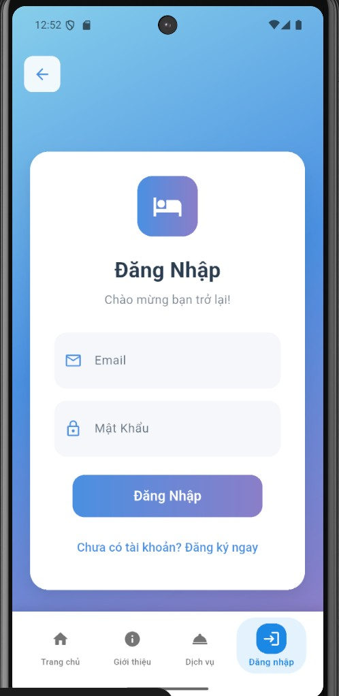 
  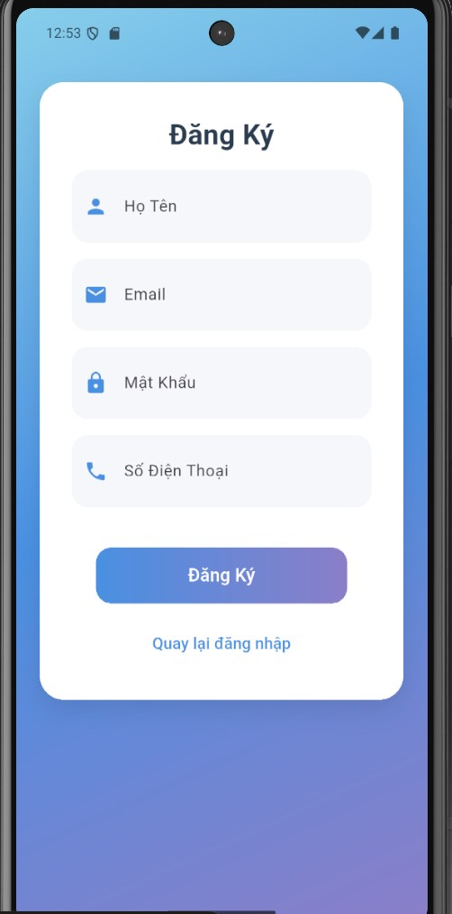

<!-- width="45%" là ví dụ, bạn có thể điều chỉnh để ảnh vừa vặn. 
     Để có khoảng cách giữa 2 ảnh, bạn có thể thêm một vài   hoặc dùng CSS nếu Markdown của bạn hỗ trợ (GitHub Markdown hạn chế CSS)
     Ví dụ:      
-->

**Trang Chủ:**

  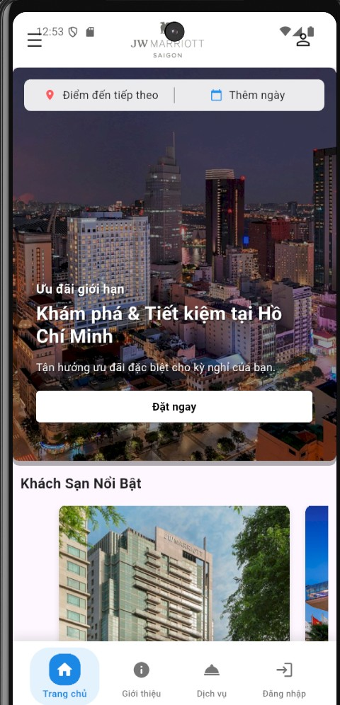
  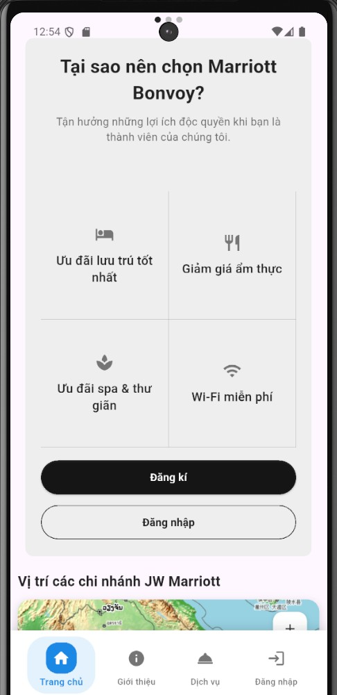

**Trang Chi Tiết Khách Sạn:**

  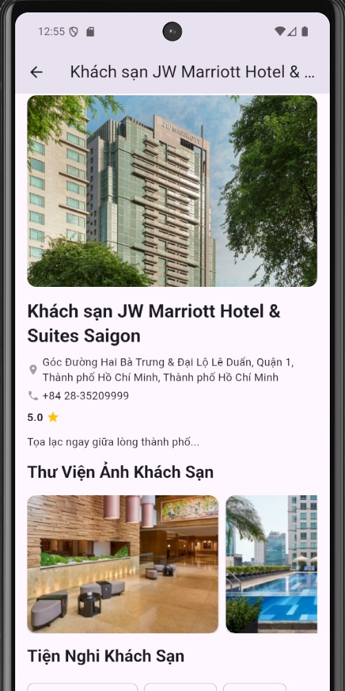
  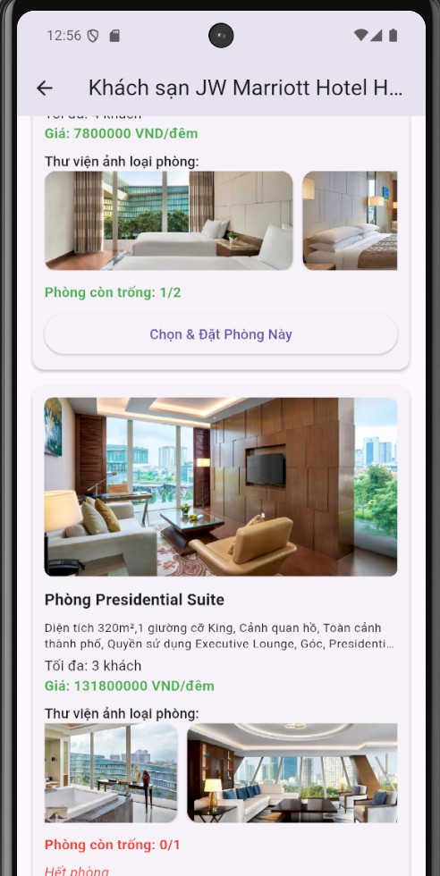
  <!-- Thêm ảnh thứ 3 nếu có -->
  <!--  -->

**Trang Quản Lý Phòng:**

  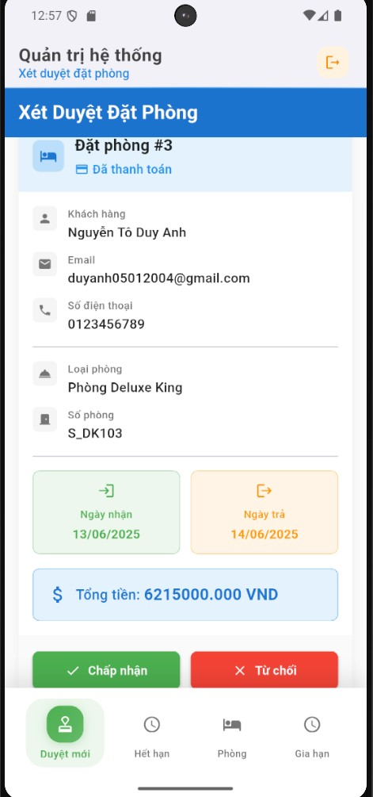
  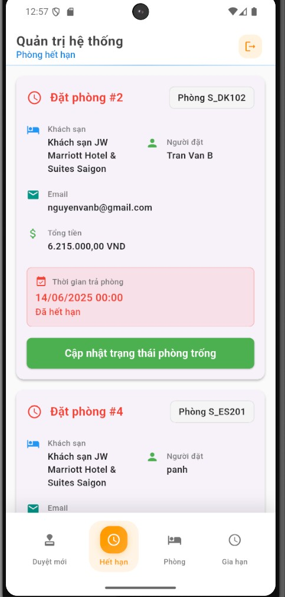
  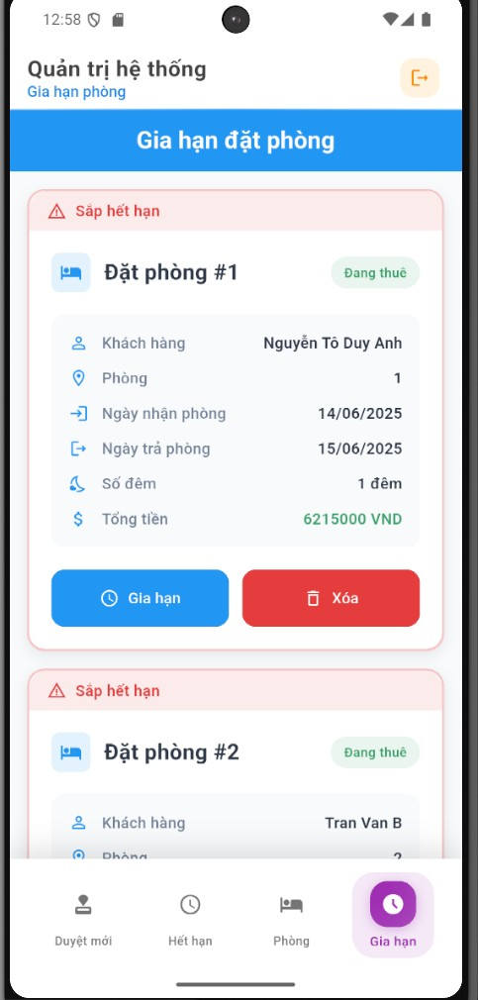

**Thông Tin Đặt Phòng:**

  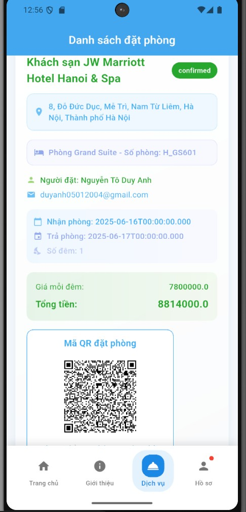
  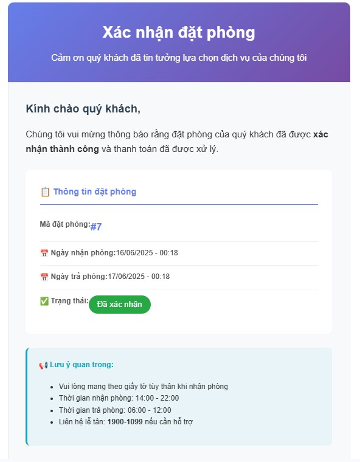
  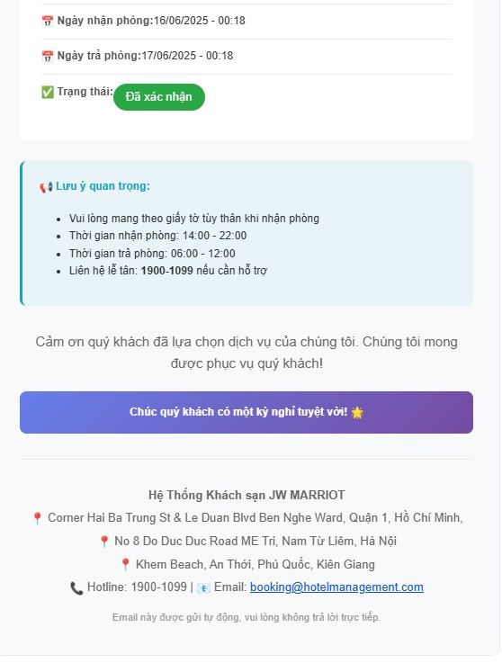

<!-- ... các phần khác của README ... -->
## Nguồn Tham Khảo

Trong quá trình xây dựng ứng dụng này, nhóm em đã tham khảo và sử dụng các tài liệu, thư viện sau:

*   **Tài liệu chính thức của Flutter và Dart:**
    *   [Flutter Documentation](https://flutter.dev/docs) - Nguồn tài liệu chính thức và toàn diện nhất về Flutter.
    *   [Dart Language Tour](https://dart.dev/guides/language/language-tour) - Hướng dẫn chi tiết về ngôn ngữ Dart.
    *   [Pub.dev](https://pub.dev/) - Trang tham khảo các thư viện trong flutter
    *   [sites.google.com/view/success-key](https://sites.google.com/view/success-key) - Trang tài liệu học tập chính trên lớp
    *   

*   **Thư viện Flutter (Plugins):**
    *   [`sqflite`](https://pub.dev/packages/sqflite) - Plugin để tương tác với cơ sở dữ liệu SQLite trên Flutter.
    *   [`path_provider`](https://pub.dev/packages/path_provider) - Plugin để tìm các đường dẫn thư mục thường dùng trên hệ thống file.
    *   [`path`](https://pub.dev/packages/path) - Tiện ích để làm việc với đường dẫn file và thư mục.
    *   [`intl`](https://pub.dev/packages/intl) - (Nếu bạn có sử dụng) Plugin cho việc quốc tế hóa và định dạng (ví dụ: ngày tháng, số).
    *   *(Liệt kê các plugin quan trọng khác mà bạn đã sử dụng)*

*   **Kiến thức về SQLite và Thiết kế CSDL:**
    *   [SQLite Official Documentation](https://www.sqlite.org/docs.html) - Tài liệu chính thức về SQLite.
    *   (Nếu có) Các bài viết, sách, hoặc khóa học về thiết kế cơ sở dữ liệu quan hệ.

---

## Đóng Góp

Đây là một dự án học tập. Mọi ý kiến đóng góp hoặc báo lỗi đều được chào đón. Vui lòng tạo một(https://github.com/Andy-Nguy/Hotelbooking_25/issues)) để thảo luận.

## Tác Giả

*   **[Nguyễn Tô Duy Anh]** - *Nhóm trưởng* -(https://github.com/Andy-Nguy))
*   **[Nguyễn Phương Anh]** - *SinhVien* - 
*   **[Nguyễn Dương Lệ Chi]** - *SinhVien* - 
